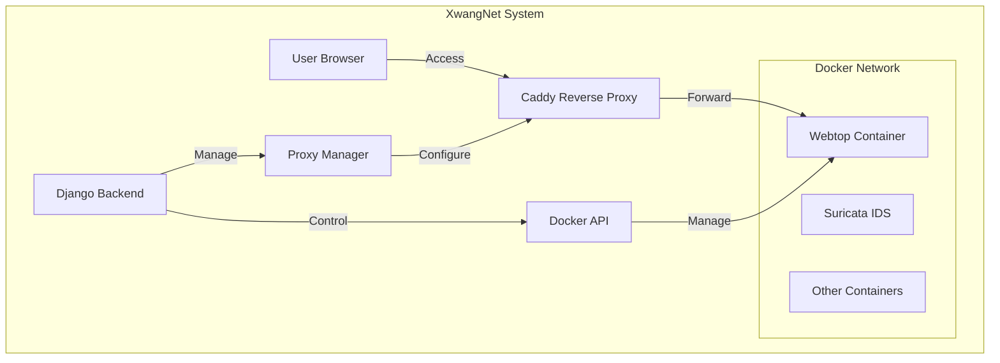
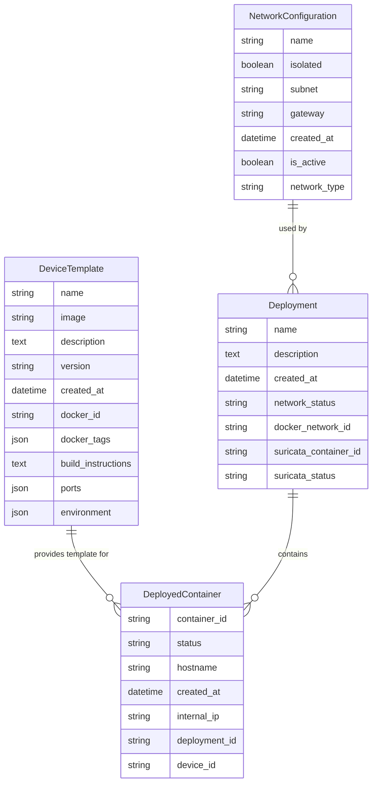

# XWangNet Development Documentation

## Overview
XWangNet is a Django-based application for managing Docker networks and containers, specifically designed for network device virtualization with integrated security monitoring through Suricata IDS.

## System Architecture


## Data Model


## Core Components

### DeviceTemplate
Template for network devices with Docker configurations:
- Name and image management
- Version control
- Port and environment configuration
- Build instruction storage

### NetworkConfiguration
Network environment settings:
- Subnet and gateway configuration
- Isolation controls
- Network type specification (bridge/host)
- Active status tracking

### Deployment
Complete network deployment management:
- Network status tracking
- Docker network integration
- Suricata IDS integration
- Container orchestration

### DeployedContainer
Individual container instance management:
- Container lifecycle tracking
- Hostname and IP management
- Status monitoring
- Template association

## Key Features

### Network Management
- Isolated network environments
- Custom subnet configurations
- Network status monitoring
- Docker network integration

### Container Management
- Template-based deployment
- Lifecycle management (start/stop/delete)
- Status monitoring
- Automatic cleanup

### Security Features
- Suricata IDS integration
- Network traffic monitoring
- Isolated network environments
- Status tracking

### Proxy Management
- Caddy reverse proxy integration
- Webtop container access
- Dynamic proxy configuration
- Hostname-based routing

## API Endpoints

### Deployment Operations
- `POST /deployment/create/`: Create new deployment
- `DELETE /deployment/{id}/`: Remove deployment
- `POST /deployment/{id}/network/`: Toggle network status
- `POST /deployment/{id}/deploy-suricata/`: Deploy Suricata IDS
- `POST /deployment/{id}/stop-suricata/`: Stop Suricata monitoring

### Container Operations
- `POST /container/{id}/action/`: Container lifecycle management
- `GET /container/{id}/logs/`: Container log retrieval
- `DELETE /deployed-container/{id}/delete/`: Remove deployed container
- `GET /container/{id}/buttons/`: Update container controls

### Network Operations
- `POST /network/configure/`: Configure network settings
- `GET /networks/`: List all networks
- `POST /networks/{id}/action/`: Network actions

## Development Guidelines

### Docker Operations
```python
# Use image IDs for container creation
image = client.images.get(container.device.image)
docker_container = client.containers.run(
    image.id,
    name=f"{container.hostname}-{container.id}",
    hostname=container.hostname,
    network=deployment.network.name,
    detach=True,
    remove=True
)
```

### Error Handling
- Docker API errors
- Network configuration issues
- Container lifecycle errors
- Proxy configuration failures

### Status Management
- Container status tracking
- Network state consistency
- Suricata monitoring status
- Deployment state management

### Best Practices
1. Use unique identifiers for all resources
2. Implement proper cleanup procedures
3. Validate configurations before deployment
4. Monitor resource usage
5. Handle concurrent operations safely

## Testing Guidelines
1. Container lifecycle tests
2. Network isolation verification
3. Suricata integration tests
4. Proxy configuration tests
5. Error handling validation

## Common Issues and Solutions
1. Container name conflicts
   - Use unique name generation with IDs
   - Implement automatic cleanup

2. Network state inconsistency
   - Verify network state before operations
   - Implement proper cleanup procedures

3. Proxy configuration issues
   - Validate hostname configurations
   - Check Caddy connectivity

4. Suricata integration
   - Verify container accessibility
   - Monitor resource usage