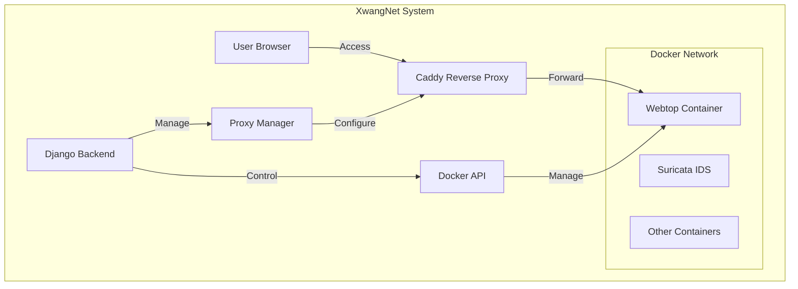

# XwangNet (双网 / 仿网)

Network Digital Twin for Embedded Devices - A platform for creating and managing isolated network environments with security monitoring capabilities.

## Overview

XwangNet is a Django-based application that enables the creation and management of network digital twins. It provides a comprehensive solution for:

- 🌐 Creating isolated network environments
- 📦 Managing containerized network devices
- 🔒 Integrated security monitoring with Suricata IDS
- 🖥️ Web-based access to network devices via Webtop
- 🔍 Network traffic analysis and monitoring

## Key Features

### Network Management
- Create isolated network environments
- Custom subnet and gateway configuration
- Network status monitoring
- Docker network integration

### Device Management
- Template-based device deployment
- Container lifecycle management
- Web-based device access
- Automated resource cleanup

### Security Features
- Integrated Suricata IDS
- Network traffic monitoring
- Isolated network environments
- Security event tracking

### User Interface
- Web-based administration
- Device template management
- Network configuration interface
- Deployment monitoring

## Documentation

- [Installation Guide](Installation.md) - Setup and configuration instructions
- [Development Documentation](Development.md) - Technical details and API reference
- [API Documentation](docs/api.md) - REST API endpoints and usage

## Quick Start

1. Install dependencies:
```bash
python3 -m venv venv
source venv/bin/activate
pip install -r requirements.txt
```

2. Start required services:
```bash
docker-compose up -d
```

3. Initialize the application:
```bash
python3 manage.py migrate
python3 manage.py createsuperuser
```

4. Run the application:
```bash
daphne -b 0.0.0.0 -p 8000 xwangnet.asgi:application
```

For detailed setup instructions, see [Installation Guide](Installation.md).

## Sample Nodes (Docker Images)

You may retrieve sample nodes built for XwangNet in the link below
[DLINK DIR-846 (Router)](https://cloud.keranode.cc/s/pqFWJkRXqNF8JBz)

[TRIVISION NC227WF (Ip Cam)](https://cloud.keranode.cc/s/SeFgxYkLbq4DA8y)

[DLINK DCS-935L (Ip Cam)](https://cloud.keranode.cc/s/EfqyzRgb6na5b25)


## Architecture



## Current Status

- ✅ Network isolation and management
- ✅ Container deployment and lifecycle management
- ✅ Suricata IDS integration
- ✅ Web-based device access
- ✅ Basic network monitoring
- 🚧 Remote network access (VPN integration)
- 🚧 Firmware analysis automation
- 🚧 SIEM integration

## Contributing

1. Fork the repository
2. Create your feature branch
3. Commit your changes
4. Push to the branch
5. Create a Pull Request

## License

This project is licensed under the MIT License - see the [LICENSE](LICENSE) file for details.
